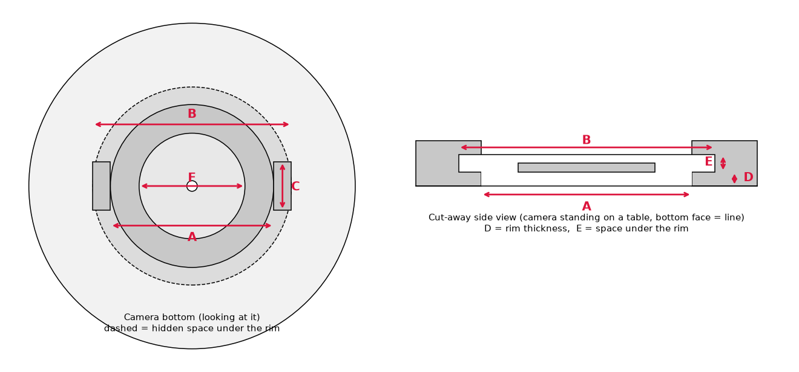

# Tapo C200 천장 마운트 (3D 프린트용)


## 어떻게 생겼나요?

```
 ═════════════  ← 천장
 ┌───────────┐  ① 천장 판 (Ø90, 접시머리 나사 3개로 고정)
 └───┐   ┌───┘
     │ = │      ② 기둥 (Ø24, '=' 는 케이블 타이 구멍)
    ╱     ╲
   └───────┘    ③ 받침 판 (Ø52, 카메라 바닥 고무발 안쪽에 맞는 크기)
     ┗┳┛        ④ 걸쇠: 카메라 바닥 홈에 넣고 돌려서 잠금
    [ C200 ]
```

C200 바닥에는 **가운데 둥근 홈과 양쪽 입구 2개**가 있습니다.
정품 베이스처럼 **걸쇠 날개 2개를 입구에 맞춰 넣고 → 돌리면**, 날개가 홈 테두리 밑으로
들어가 카메라가 빠지지 않습니다. 이 걸쇠를 마운트에 직접 만들어서 정품 베이스가 필요 없습니다.

(정품 베이스를 쓰고 싶으면 매크로에서 `MOUNT_TYPE = "original_base"`로 바꾸면
걸쇠 대신 정품 베이스를 나사로 고정하는 평평한 받침 판이 만들어집니다.)

## 파일

| 파일 | 용도 |
|---|---|
| `tapo_c200_ceiling_mount.FCMacro` | FreeCAD 매크로 (치수 변경 후 다시 실행하면 모델 재생성) |
| `tapo_c200_fit_test.stl` | **먼저 뽑는 시험 조각** (걸쇠 + 얇은 판, 10분 내외) |
| `tapo_c200_ceiling_mount.stl` | 마운트 본체 |
| `tapo_c200_ceiling_mount.step` | 다른 CAD에서 수정할 때 |
| `measure_guide.png` | 카메라 바닥 치수 재는 위치 그림 |

## ⚠️ 걸쇠 치수는 추정값입니다 — 시험 조각부터!

걸쇠 치수는 카메라 바닥 사진을 보고 추정한 값입니다. 그래서:

1. `tapo_c200_fit_test.stl`을 먼저 출력해서 카메라에 끼워 보세요.
2. 결과에 따라 매크로 위쪽 숫자를 고칩니다.

| 증상 | 고칠 값 |
|---|---|
| 날개가 입구에 안 들어감 | `NOTCH_WIDTH` 줄이기 또는 `UNDERCUT_DIAMETER` 줄이기 |
| 목(둥근 부분)이 홈에 안 들어감 | `OPENING_DIAMETER` 줄이기 |
| 들어가는데 안 돌아감 | `LIP_THICKNESS` 키우기 또는 `UNDERCUT_HEIGHT` 줄이기 |
| 돌아가는데 덜컹거림 | `UNDERCUT_HEIGHT` 키우기 (0.2mm씩) |
| 전체적으로 빡빡함 / 헐거움 | `FIT_CLEARANCE` 0.4~0.5 / 0.2 |
| 가운데가 걸림 | `CENTER_DIAMETER` 키우기 |

캘리퍼스(버니어)가 있으면 아래 그림의 A~F를 재서 넣는 게 가장 빠릅니다.



| 기호 | 매크로 변수 | 재는 곳 | 현재값(추정) |
|---|---|---|---|
| A | `OPENING_DIAMETER` | 가운데 둥근 홈 입구 지름 | 37 |
| B | `UNDERCUT_DIAMETER` | 한쪽 입구 바깥 끝 ~ 반대쪽 입구 바깥 끝 | 45 |
| C | `NOTCH_WIDTH` | 입구 하나의 폭 | 11 |
| D | `LIP_THICKNESS` | 바닥 면 ~ 테두리 아랫면 (입구 옆면에서 보임) | 2.5 |
| E | `UNDERCUT_HEIGHT` | 입구에 캘리퍼스 깊이봉을 넣어 잰 깊이 − D | 3.0 |
| F | `CENTER_DIAMETER` | 가운데 원판(작은 점 있는 부분) 지름 | 24 |

## FreeCAD에서 여는 법

1. FreeCAD → **매크로 → 매크로...** → `tapo_c200_ceiling_mount.FCMacro` 선택 → **실행**
2. 모델이 새 문서에 생기고, 같은 폴더에 STL/STEP와 시험 조각 STL이 새로 저장됩니다.
3. 치수를 바꾸려면 매크로 파일 위쪽 `치수` 부분의 숫자만 고치고 다시 실행하세요.
   - 카메라를 천장에서 더 띄우기: `TOTAL_DROP` (기본 60mm = 천장 ~ 받침 판 윗면)

## 출력 설정 (권장)

- 방향: **넓은 천장 판을 베드에 붙인 그대로** (본체는 45° 경사로 설계되어 서포트 불필요)
- 걸쇠 날개 아래는 약 4mm 짧게 튀어나온 부분이라 보통 서포트 없이 뽑힙니다.
  아래가 처지면 슬라이서에서 **날개 아래만 서포트**(서포트 페인트)를 주세요.
- 재료: PETG 권장 (PLA도 가능, 단 햇빛 드는 창가·여름철 고온엔 PETG/ASA)
- 벽(월) 4줄 이상, 인필 30% 이상, 레이어 0.2mm

## 설치 순서

1. 카메라 바닥에 붙어 있는 이전 출력물 조각(노란 필라멘트)이 있다면 떼어 내세요.
   입구를 막으면 걸쇠가 안 들어갑니다.
2. 천장 판을 **Ø4 접시머리 나사 3개**로 천장에 고정합니다.
   - 석고보드 천장이면 반드시 **석고보드 앵커**를 쓰세요.
3. 카메라 바닥 입구 2개를 걸쇠 날개에 맞춰 밀어 넣고 **시계 방향으로 돌려** 잠급니다.
4. 전원 케이블은 기둥의 케이블 타이 구멍으로 묶어 정리합니다.
5. Tapo 앱 → 카메라 설정 → **화면 180° 회전(Rotate Image)** 켜기
   (거꾸로 달면 영상이 뒤집혀 보이기 때문)

> 안전: 카메라를 달기 전에 걸쇠에 끼운 상태로 아래로 세게 당겨 보고,
> 날개에 금이 가거나 쉽게 빠지면 사용하지 마세요.
