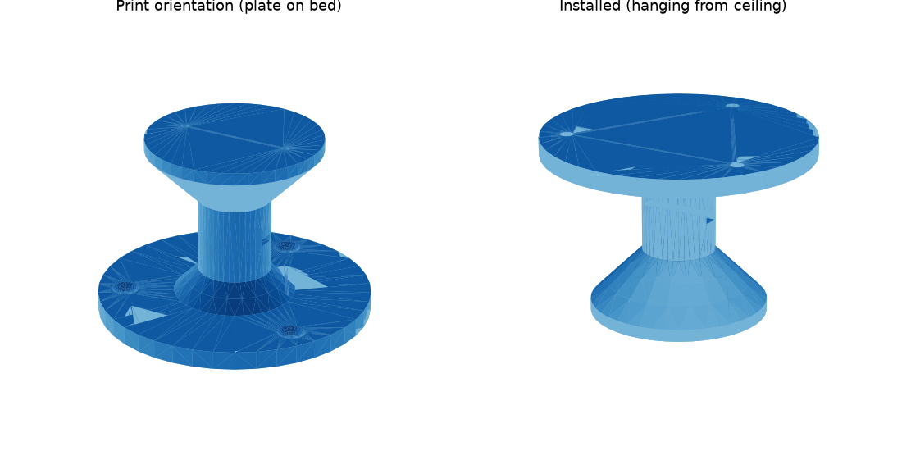

# Tapo C200 천장 마운트 (3D 프린트용)



## 어떻게 생겼나요?

```
 ═════════════  ← 천장
 ┌───────────┐  ① 천장 판 (Ø90, 접시머리 나사 3개로 고정)
 └───┐   ┌───┘
     │ = │      ② 기둥 (Ø24, '=' 는 케이블 타이 구멍)
    ╱     ╲
   └───────┘    ③ 받침 판 (Ø58) ← 여기에 C200 정품 마운트 베이스를 나사로 고정
     [ C200 ]   카메라는 정품 베이스에 끼우고 돌려서 잠금
```

C200 바닥은 **정품 마운트 베이스에 끼워서 돌리는(트위스트 잠금) 방식**입니다.
이 잠금 홈을 3D 프린트로 흉내 내면 치수가 조금만 어긋나도 카메라가 떨어질 수 있어서,
**정품 베이스는 그대로 쓰고, 그 베이스를 붙일 받침만 프린트**하도록 설계했습니다.

## 파일

| 파일 | 용도 |
|---|---|
| `tapo_c200_ceiling_mount.FCMacro` | FreeCAD 매크로 (치수 변경 후 다시 실행하면 모델 재생성) |
| `tapo_c200_ceiling_mount.stl` | 바로 슬라이서에 넣어 출력 |
| `tapo_c200_ceiling_mount.step` | 다른 CAD에서 수정할 때 |

## FreeCAD에서 여는 법

1. FreeCAD → **매크로 → 매크로...** → `tapo_c200_ceiling_mount.FCMacro` 선택 → **실행**
2. 모델이 새 문서에 생기고, 같은 폴더에 STL/STEP가 새로 저장됩니다.
3. 치수를 바꾸려면 매크로 파일 위쪽 `치수` 부분의 숫자만 고치고 다시 실행하세요.
   - 카메라를 천장에서 더 띄우기: `TOTAL_DROP` (기본 60mm, 최소 약 39mm)
   - 정품 베이스 나사 간격이 다를 때: `BASE_SCREW_SPACING` (기본 37mm)

## 출력 설정 (권장)

- 방향: **넓은 천장 판을 베드에 붙인 그대로** (서포트 필요 없음, 45° 경사로 설계)
- 재료: PETG 권장 (PLA도 가능, 단 햇빛 드는 창가·여름철 고온엔 PETG/ASA)
- 벽(월) 4줄 이상, 인필 30% 이상, 레이어 0.2mm
- 예상 부피 약 90cm³ (인필 30% 기준 대략 50~60g)

## 설치 순서

1. **정품 마운트 베이스 나사 간격 확인**: 베이스를 받침 판 위에 올려서 구멍이
   안내 구멍(Ø2.5)과 맞는지 봅니다. 안 맞으면 받침 판이 꽉 찬 구조라
   베이스 구멍 위치에 드릴(Ø2.5)로 새로 뚫어도 됩니다.
2. 정품 베이스를 **짧은 피스(Ø3 × 10mm 정도)** 로 받침 판에 고정합니다.
3. 천장 판을 **Ø4 접시머리 나사 3개**로 천장에 고정합니다.
   - 석고보드 천장이면 반드시 **석고보드 앵커**를 쓰세요.
4. 카메라를 베이스에 끼우고 돌려서 잠급니다.
5. 전원 케이블은 기둥의 케이블 타이 구멍으로 묶어 정리합니다.
6. Tapo 앱 → 카메라 설정 → **화면 180° 회전(Rotate Image)** 켜기
   (거꾸로 달면 영상이 뒤집혀 보이기 때문)

> 안전: 프린트한 부품은 사용 전 손으로 세게 당겨 흔들어 보고,
> 금이 가거나 층이 벌어지면 사용하지 마세요.
